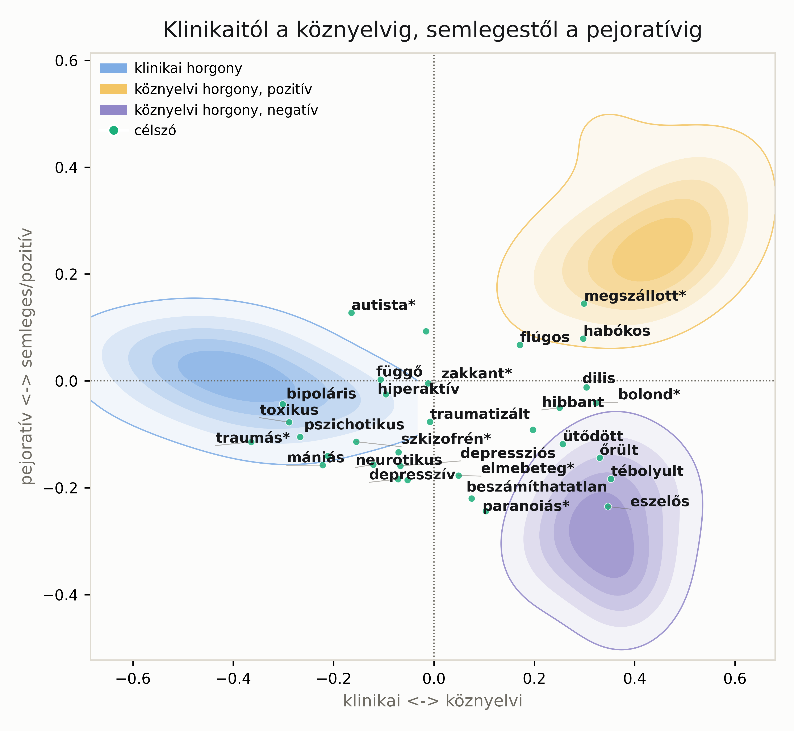

# Klinikumtól a köznyelvig: a magyar "őrültség-szókincs" egy szóvektoros térképe

## Bevezetés

Platón állítólag egyszer azzal állt elő, hogy az embert a legegyszerűbben úgy határozhatjuk meg, mint "tollatlan kétlábú élőlényt". Diogenész, a kynikus filozófus erre másnap megjelent az Akadémián egy megkopasztott kakassal a kezében, és bejelentette: "Íme, Platón embere." A tanulság ismerős mindenkinek, aki valaha próbált egy fogalmat pontos meghatározással körülhatárolni: néhány kiválasztott tulajdonság ritkán fogja meg azt, amit valójában mondani akarunk. Arisztotelész, aki ezzel a fajta meghatározással sokat foglalkozott, azt gondolta, hogy a dolgoknak vannak lényegi tulajdonságaik (amik nélkül nem tartoznának az adott kategóriába) és esetleges tulajdonságaik (amik lehetnének másképp is, anélkül hogy a besorolás megváltozna). Az ember lényegi tulajdonsága, hogy racionális élőlény; hogy valaki orvos, hetven éves vagy éppen kopasz, esetleges, a kategóriába tartozás szempontjából érdektelen tulajdonság.

Ez a fajta gondolkodás a huszadik századig meglehetősen uralta a jelentésről és a kategóriákról szóló filozófiai és nyelvészeti elképzeléseket, mire Wittgenstein (1958) rámutatott, hogy a hétköznapi kategóriáink (az ő híres példája a "játék" szó) nem egy közös, mindenki által birtokolt lényegi tulajdonságkészlet alapján szerveződnek, hanem inkább családi hasonlóságok hálózata alapján: minden játék hasonlít valamennyire a többihez, de nincs egyetlen tulajdonság, ami mindegyikben közös lenne. Rosch (1973), majd Labov (1973) kísérletekkel is alátámasztották, hogy a hétköznapi kategorizáció gradiensen működik: vannak jobb és rosszabb példányai egy kategóriának (a veréb jobb példánya a "madár" kategóriának, mint a pingvin), és a kategóriák határai elmosódottak, nem élesek.

Ma ez a felfogás számít tudományos konszenzusnak. Van azonban a nyelvhasználatnak néhány zuga, ahol makacsul tovább él az arisztotelészi, checklist-szerű kategorizáció: a jogi és a klinikai nyelvhasználat. Hogy valaki kiskorú-e vagy nagykorú, magyar állampolgár-e vagy sem, arról nem hasonlóság alapján döntünk, hanem egy pontosan megfogalmazott kritériumlista alapján. Hasonlóan működik (legalábbis papíron) a pszichiátriai diagnosztika is: a Diagnostic and Statistical Manual of Mental Disorders (DSM) és a Betegségek Nemzetközi Osztályozása (BNO) is tünetek egy adott számát és kombinációját írja elő ahhoz, hogy valakit depressziósnak vagy szkizofrénnek diagnosztizáljunk.

Ezzel a klinikai, checklist-alapú jelentéssel szemben azonban ott áll egy köznyelvi használat, ami látszólag semmit sem tud, vagy nem akar tudni erről a kritériumlistáról. Amikor valaki azt mondja, "nagyon depis vagyok ma", nem a BNO kritériumaira gondol, hanem valami olyasmire, hogy fáradt, kedvetlen, szomorú. A "szkizofrén" szónak is van egy olyan köznyelvi élete, ami alig hasonlít az orvosi diagnózisra (gyakran egyszerűen "ellentmondásos" vagy "kettős" jelentésben használják). És vannak szavaink, amik valaha talán szakszók voltak, de mára inkább csak folklorisztikus emlékei egy régi orvosi nyelvnek: "alkoholista" ma sincs a hivatalos nosológiában, a jelenlegi terminológia inkább "alkoholhasználati zavarról" beszél, mégis mindenki tudja, mit jelent a szó a hétköznapokban.

Ez a tanulmány arra kíváncsi, hogy a fenti feszültség - klinikai checklist kontra köznyelvi, elmosódott jelentés - valahogyan tetten érhető-e a nyelvhasználat mintázataiban magukban, ha van rá megfelelő eszközünk. Konkrétan: ha megnézzük, hogy a magyar nyelvhasználatban a "depresszív", "szkizofrén", "paranoiás" és hasonló szavak milyen más szavak társaságában szoktak előfordulni, akkor ezek inkább a klinikai szavak társaságát fogják-e keresni, vagy inkább a köznyelvi, hétköznapi szavakét? És ha van ilyen elmozdulás a köznyelv felé, az szükségszerűen pejoratívvá is teszi-e a szót, vagy lehet valaki köznyelviesen, de nem sértő módon "őrült"?

## Szóvektorok, dióhéjban

A fenti kérdés megválaszolásához egy viszonylag egyszerű, ám sokoldalúan használható nyelvtechnológiai eszközre van szükségünk, amit szóvektornak vagy szóbeágyazásnak hívnak. Az alapötlet Firth (1957) nevéhez köthető, aki szerint egy szó jelentését jórészt megadja az, hogy milyen más szavak társaságában szokott előfordulni. Ha végignézzük a magyar Wikipédiát, azt találjuk, hogy a "kutya" és a "macska" szavak nagyon gyakran ugyanazokon az oldalakon fordulnak elő (háziállatokról, domesztikációról szóló szócikkekben), míg a "kutya" és az "atomreaktor" szavak jóval ritkábban (kivéve talán a paksi atomerőmű őrkutyáiról szóló bekezdést, ha van ilyen).

Ha ezt a fajta együttes előfordulást emberek helyett gépi statisztikákkal, több millió mondatnyi szövegen mérjük meg, akkor minden szóhoz hozzá tudunk rendelni egy hosszú számsort (egy "vektort") úgy, hogy a hasonló kontextusban előforduló szavak vektorai egymáshoz közel kerüljenek egy sokdimenziós térben. Ez a word2vec nevű, azóta klasszikussá vált eljárás alapötlete (Church, 2017). Az eredmény egy olyan tér, amiben a szavak közötti távolság nagyjából megfelel a szavak jelentésbeli hasonlóságának - és amiben, mint azt hamarosan látni fogjuk, nemcsak azt lehet megnézni, hogy két szó mennyire hasonló egymáshoz, hanem azt is, hogy egy szó hol helyezkedik el két, általunk kijelölt jelentéstartomány (mondjuk "pozitív" és "negatív") között. Ez utóbbi ötlet nem új: a szövegbányászatban jól ismert "sentiment analysis" (véleménybányászat) évtizedek óta ugyanezt csinálja, amikor pozitív vagy negatív szavak listája alapján próbálja eldönteni egy szövegről, hogy dicsér-e valamit vagy panaszkodik.

## A kérdés: hol laknak ezek a szavak?

A kérdésünk tehát a következő: ha a fent leírt módon feltérképezzük a magyar szóhasználatot, akkor az olyan diagnosztikus szavak, mint a "szkizofrén" vagy a "depresszió" melléknévi alakjai, milyen más szavak társaságában fognak feltűnni? Klinikai szavak társaságában, mint a "komorbiditás" és a "remisszió", vagy köznyelvi szavak társaságában, mint a "szomorú" és a "fáradt"? Ezt a fajta kérdésfeltevést nem mi találtuk ki: Kozlowski, Taddy és Evans (2019) hasonló módszerrel térképezték fel, hogy az amerikai angol nyelvhasználatban a társadalmi osztály fogalma milyen más fogalmakkal (ízléssel, pénzzel, erkölccsel) fonódik össze - ők úgy hívták ezt, hogy "a kultúra geometriája". Mi ugyanezt a geometriai gondolkodást szeretnénk alkalmazni a klinikai és köznyelvi regiszter kérdésére.

Van itt egy érdekes csavar, ami visszakanyarodik a bevezetőben tárgyalt Arisztotelész-Wittgenstein-vitához. Azt gondolhatnánk, hogy a pszichiátriai diagnosztika az utolsó védőbástyája az arisztotelészi, checklist-alapú kategorizációnak - hiszen pontosan ez a DSM és a BNO célja. Csakhogy amikor megnézzük, hogy a klinikusok a gyakorlatban valójában hogyan diagnosztizálnak, egészen más képet kapunk. Cantor, Smith, French és Mezzich (1980) klasszikus kísérlete megmutatta, hogy a pszichiáterek a diagnózisok felállításakor lényegében ugyanazt a prototípus-alapú, hasonlósági ítéletet hozzák meg, mint amikor mi eldöntjük, hogy egy adott madár inkább verébszerű-e vagy pingvinszerű - nem egy mereven alkalmazott kritériumlistát pipálgatnak végig. Kendler, Zachar és Craver (2011) ezt továbbgondolva amellett érvelnek, hogy a pszichiátriai kategóriák jó eséllyel eleve nem olyan "természetes fajták", amikre egy éles, arisztotelészi definíció ráhúzható lenne. Ha pedig még a szakemberek diagnosztikus gyakorlata is gradiens, hasonlóság-alapú folyamat, akkor talán nem meglepő, hogy a diagnosztikus szavak köznyelvi élete is hasonlóan elmosódott határvonalak mentén alakul.

Ennek a köznyelviesedésnek külön neve is van a pszichológiai szakirodalomban: "concept creep", vagyis fogalmi kúszás (Haslam, 2016), ami eredetileg olyan fogalmak (mint a trauma, a bántalmazás vagy a betegség) fokozatos jelentéstágulására utal, amelyek egyre szélesebb és enyhébb jelenségekre is elkezdik lefedni magukat. Beeker és munkatársai (2021) ezt egy tágabb társadalmi folyamat, a "pszichiatrizálódás" részeként írják le, amiben a mindennapi élet egyre nagyobb hányadát kezdjük pszichiátriai fogalmakkal leírni. Amit mi csinálunk, az ennek egy nagyon konkrét, szómagasságú vizsgálata: négy szólistát állítunk össze, és megnézzük, ezekhez képest hova esnek a célszavaink egy kétdimenziós térben.

## Módszer, madártávlatból

A módszertani részleteket szándékosan röviden tárgyaljuk itt - aki mélyebben érdeklődik, a cikk végén található Zenodo-hivatkozáson megtalálja a teljes kódot, az adatokat és a szólistákat.

Egy nyilvánosan elérhető magyar szóvektor-adatbázist használtunk (hunembed0.0; Makrai, é. n.), ami a Magyar Webkorpusz (Halácsy et al., 2004) és a Magyar Nemzeti Szövegtár (Váradi, 2002) szövegein lett betanítva. Fontos előre jelezni: mindkét forrás a kétezres évek elejéről-közepéről származik, vagyis jóval a közösségi média és a mai, terápiás nyelvezettől átitatott online diskurzus előttről - erre a diszkusszióban még visszatérünk.

Négy szólistát állítottunk össze, és mind a négyet szigorúan mellléknevekre korlátoztuk, hogy a szófaj maga ne zavarja be az összehasonlítást:

1. **Klinikai horgonyszavak**: technikai, latinos hangzású diagnosztikus melléknevek, amiknek nincs érdemi köznyelvi életük - pl. *terápiarezisztens*, *patológiás*, *iatrogén*, *malignus*, *benignus*.
2. **Semleges/pozitív köznyelvi horgonyszavak**: hétköznapi, pozitív vagy semleges hangulatú melléknevek - pl. *jó*, *kedves*, *nyugodt*, *vidám*.
3. **Pejoratív köznyelvi horgonyszavak**: hétköznapi, negatív hangulatú melléknevek - pl. *rossz*, *szomorú*, *ijesztő*, *unalmas*.
4. **Célszavak**: azok a diagnosztikus melléknevek, amikről feltételezzük, hogy kettős életük lehet - pl. *depressziós*, *szkizofrén*, *autista*, *paranoiás*, *bipoláris*, *toxikus*, valamint egy külön szócsalád, ami kifejezetten az "őrültség" fogalmát öleli fel a klinikai-jogi regisztertől (*elmebeteg*, *beszámíthatatlan*) az irodalmi hangvételen át (*tébolyult*, *eszelős*) egészen a tiszta szlengig (*dilis*, *hibbant*, *zakkant*, *flúgos*, *habókos*, *ütődött*, *bolond*, *őrült*).

Miután minden szóhoz megvan a maga szóvektora, két tengelyt építettünk. A **regiszter-tengely** a klinikai horgonyszavak átlagos pozíciójától a két köznyelvi horgonycsoport együttes átlagos pozíciója felé mutat - ezen helyezkedik el minden szó aszerint, hogy inkább klinikai vagy inkább köznyelvi társaságban fordul-e elő. A **valencia-tengely** erre merőlegesen a pejoratív és a semleges/pozitív köznyelvi horgonyszavak között húzódik, és azt mutatja meg, hogy a köznyelvi irányba mozduló szavak inkább negatív, becsmérlő, vagy inkább semleges-pozitív társaságban fordulnak-e elő. A két tengely együtt egy kétdimenziós térképet ad, amire minden célszavunkat rá tudjuk vetíteni.

## Eredmények: egy térkép

Az 1. ábra mutatja ezt a kétdimenziós teret. A vízszintes tengelyen balra a klinikai, jobbra a köznyelvi pólus van; a függőleges tengelyen lent a pejoratív, fent a semleges/pozitív pólus. A kék pontok a klinikai horgonyszavak - ezek, ahogy vártuk, szépen egy csomóban ülnek a bal oldalon, és a függőleges tengelyen nagyjából semlegesek (a klinikai nyelvhasználatnak nincs különösebb pozitív vagy negatív töltete). A sárga pontok a semleges/pozitív, a lila pontok a pejoratív köznyelvi horgonyszavak - ezek szépen szétválnak a térkép felső, illetve alsó részére. Ez azt igazolja, hogy a két tengely tényleg azt méri, amit mérni szerettünk volna.

A célszavaink - a zöld pontok - egy nagyjából háromszög alakú felhőt rajzolnak ki. A bal oldalon, a klinikai horgonyszavak közelében találjuk azokat a szavakat, amik nagyon egyértelműen klinikai használatúak maradtak: a *traumás*, a *bipoláris*, a *toxikus*, a *pszichotikus* mind ide tartozik. Ahogy elindulunk jobbra, egyre inkább köznyelviesebb szavakhoz érünk: az *autista*, a *szkizofrén*, a *neurotikus*, a *függő*, a *hiperaktív*, a *depressziós* és a *depresszív* mind valahol a középtájon helyezkednek el - se nem tisztán klinikaiak, se nem igazán köznyelviek. Érdekes módon ugyanennek a szócsaládnak két tagja, a *traumás* és a *traumatizált*, jócskán eltávolodik egymástól: az előbbi a legklinikaibb szavaink egyike, az utóbbi viszont már majdnem középen ül - mintha a melléknévi igenévi forma sokkal könnyebben csúszna át a köznyelvbe, mint a "tiszta" melléknév.

Egy külön kis csoportot alkotnak azok a szavak, amik a regiszter-tengelyen nagyjából középen vannak, de a valencia-tengelyen kifejezetten negatívak: az *elmebeteg*, a *beszámíthatatlan* és a *paranoiás*. Nem véletlen, hogy az első kettő elsősorban nem is pszichiátriai, hanem jogi szaknyelvi eredetű (valakinek a beszámíthatóságát egy bírósági eljárásban szokás megállapítani) - ez a "félig klinikai, de negatív" jelleg jól illik hozzájuk.

A legköznyelviesebb, ugyanakkor kifejezetten negatív sarokban találjuk azokat a szavakat, amikre senki nem lepődik meg: az *őrült*, a *tébolyult* és az *eszelős*. Ezeknek ma gyakorlatilag nincs klinikai jelentésük (az "őrült"-nek talán valaha volt), és a nyelvhasználat egyértelműen pejoratív, lekicsinylő regiszterbe utalja őket. Van azonban egy másik, szintén köznyelvi, de nem negatív kis csoport is: a *flúgos*, a *megszállott* és a *habókos* inkább semleges vagy akár kedélyesen pozitív hangulatúak - vagyis nem minden, ami köznyelvivé válik, válik egyúttal sértővé is.

A legérdekesebb talán az, ami *nem* történt meg. Az *autista* és a *szkizofrén* szavaknak van valamekkora köznyelvi jelenlétük a mai magyar nyelvhasználatban - mégis, ezen az adathalmazon mindkettő szilárdan a klinikai oldalon maradt, és egyik sem mutatott különösebben negatív, pejoratív felhangot (az *autista* enyhén pozitív irányba is elmozdult). Ugyanez igaz a *mániás* szóra is. Vagyis legalábbis ebben az adathalmazban nem azt látjuk, hogy ezeket a szavakat általános, mindenre ráhúzható sértésként használnák az emberek - inkább megmaradt a szavak elsősorban klinikai vagy oktatási-fejlesztési kontextusú használata. Összességében az eredmények nagyjából megfelelnek az intuíciónknak - ami önmagában is megnyugtató, hiszen ha egy teljesen véletlenszerű térképet kaptunk volna, azt lenne nehéz értelmezni.

## Megbeszélés és korlátok

Amit tehát látunk: a magyar diagnosztikus szókincs nem egy éles határvonal két oldalán helyezkedik el, hanem egy elég szépen kirajzolódó lejtőn, a szigorúan klinikai használattól a teljesen köznyelvi, néhol pejoratív használatig. Ez a lejtő nem is feltétlenül egyenes: van, ami köznyelvivé válva pejoratív lesz (*őrült*, *tébolyult*), és van, ami köznyelvivé válva megmarad semlegesnek vagy akár kedveskedőnek (*flúgos*, *megszállott*). Ez önmagában talán nem meglepő azoknak, akik ismerik a nyelvi kategorizációról szóló, a bevezetőben vázolt szakirodalmat - de szerintünk azért érdemes tényleg *megmutatni*, nem csak feltételezni.

Fontosnak tartjuk azonban világosan és őszintén elmondani, hogy ez a módszer messze nem tökéletes, és jó néhány ponton sebezhető - ezeket itt csak jelezzük, anélkül hogy mindegyiket alaposan körbejárnánk.

Először is: amit itt látunk, az egyetlen pillanatfelvétel, nem egy mozgás. Az alapul szolgáló szövegkorpuszok a kétezres évek elejéről-közepéről származnak, jóval a közösségi média és a mai, "terápiás" hangvételű online diskurzus elterjedése előttről. Ha az elmúlt tizenöt-húsz évben történt egy jelentős elmozdulás a köznyelviesedés irányába - amit egyébként valószínűnek tartunk -, azt ez az adathalmaz egyszerűen nem tudja megmutatni. Amit látunk, az nem "X szó köznyelviesedik", hanem "X szó, ebben a bő húsz évvel ezelőtti szövegkorpuszban, ennyire köznyelvi vagy klinikai társaságban fordul elő".

Másodszor: a "pejoratív" horgonyszavaink valójában általános negatív hangulatú melléknevek (*rossz*, *szomorú*, *ijesztő*), nem kifejezetten sértő vagy becsmérlő szavak. Ez azt jelenti, hogy amikor azt mondjuk, egy szó "nem pejoratív", valójában csak annyit tudunk biztosan, hogy nem társul általános negatív hangulattal - azt, hogy valaki használja-e kifejezetten sértésként, ezzel a módszerrel nem tudjuk közvetlenül megmérni.

Harmadszor: amit az eredmények fejezetben bemutattunk, az egyetlen ábra kvalitatív, leíró jellegű bejárása - nem futtattunk rajta semmiféle statisztikai próbát, és nem is ez volt a cél. Ez egy illusztratív, feltáró jellegű módszer, nem egy hipotézistesztelő vizsgálat, és az ábrán látható pontos pozíciókat nem szabad precíz mérőszámként kezelni.

Negyedszer: néhány célszavunk (pl. *autista*, *megszállott*, *bolond*) a valóságban főnévként és melléknévként egyaránt gyakran előfordul, úgyhogy a tiszta "csupa melléknév" felosztásunk maga is egyszerűsítés. És persze lehetne másképp is mérni ezt a fajta köznyelviesedést - meg lehetne például nézni, hogy egy szót mennyire *konzisztensen* használnak a különböző szövegkörnyezetekben (vajon a "depresszív" szót következetesebben használják, mint az "őrült"-et?), ami egy már létező módszertani irányhoz, a szemantikai diverzitás méréséhez kapcsolódna (Hoffman, Lambon Ralph, & Rogers, 2013). Ezt itt nem vizsgáltuk.

Tisztában vagyunk vele, hogy ez a lista koránt sem teljes, és hogy maga a tanulmány sem készült a legszigorúbb akadémiai fókusszal és aprólékossággal - inkább egy játékos, feltáró kirándulásnak szántuk egy olyan kérdésbe, ami reményeink szerint a nyelvészethez nem különösebben értő pszichiáter és pszichológus olvasóknak is izgalmas lehet: hol húzódik ma a határ a diagnózisunk és a mindennapi beszédünk között, és tényleg egy éles határról van-e szó, vagy inkább egy lejtőről.

## Adatok és kód

A teljes elemzési folyamat (szólisták, kód, közbülső adatok és minden ábra, magyar és angol nyelvű változatban egyaránt) nyilvánosan elérhető a Zenodón: [ide kerül a Zenodo-hivatkozás].

## Hivatkozások

Beeker, T., Mills, C., Bhugra, D., te Meerman, S., Thoma, S., Heinze, M., & von Peter, S. (2021). Psychiatrization of society: A conceptual framework and call for transdisciplinary research. *Frontiers in Psychiatry, 12*, Article 645556. https://doi.org/10.3389/fpsyt.2021.645556

Cantor, N., Smith, E. E., French, R. D., & Mezzich, J. (1980). Psychiatric diagnosis as prototype categorization. *Journal of Abnormal Psychology, 89*(2), 181–193. https://doi.org/10.1037/0021-843X.89.2.181

Church, K. W. (2017). Word2Vec. *Natural Language Engineering, 23*(1), 155–162. https://doi.org/10.1017/S1351324916000334

Firth, J. R. (1957). Modes of meaning. In *Papers in linguistics, 1934–1951* (pp. 190–215). Oxford University Press.

Halácsy, P., Kornai, A., Németh, L., Rung, A., Szakadát, I., & Trón, V. (2004). Creating open language resources for Hungarian. In *Proceedings of the 4th International Conference on Language Resources and Evaluation (LREC 2004)* (pp. 1201–1204). ELRA.

Haslam, N. (2016). Concept creep: Psychology's expanding concepts of harm and pathology. *Psychological Inquiry, 27*(1), 1–17. https://doi.org/10.1080/1047840X.2016.1082418

Hoffman, P., Lambon Ralph, M. A., & Rogers, T. T. (2013). Semantic diversity: A measure of semantic ambiguity based on variability in the contextual usage of words. *Behavior Research Methods, 45*(3), 718–730. https://doi.org/10.3758/s13428-012-0278-x

Kendler, K. S., Zachar, P., & Craver, C. (2011). What kinds of things are psychiatric disorders? *Psychological Medicine, 41*(6), 1143–1150. https://doi.org/10.1017/S0033291710001844

Kozlowski, A. C., Taddy, M., & Evans, J. A. (2019). The geometry of culture: Analyzing the meanings of class through word embeddings. *American Sociological Review, 84*(5), 905–949. https://doi.org/10.1177/0003122419877135

Labov, W. (1973). The boundaries of words and their meanings. In C.-J. N. Bailey & R. W. Shuy (Eds.), *New ways of analyzing variation in English* (pp. 340–373). Georgetown University Press.

Makrai, M. (é. n.). *hunembed0.0* [szóbeágyazás]. EFNILEX-VECT, Nyelvtudományi Kutatóközpont. http://corpus.nytud.hu/efnilex-vect/

Rosch, E. H. (1973). Natural categories. *Cognitive Psychology, 4*(3), 328–350. https://doi.org/10.1016/0010-0285(73)90017-0

Taylor, J. R. (2003). *Linguistic categorization* (3rd ed.). Oxford University Press.

Váradi, T. (2002). The Hungarian National Corpus. In *Proceedings of the 3rd International Conference on Language Resources and Evaluation (LREC 2002)*. ELRA.

Wittgenstein, L. (1958). *Philosophical investigations* (G. E. M. Anscombe, Trans.). Macmillan. (Eredeti kiadás: 1953)
